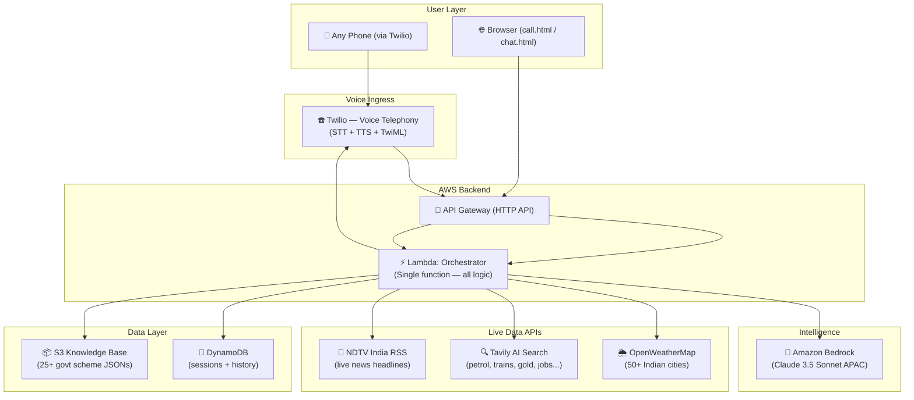
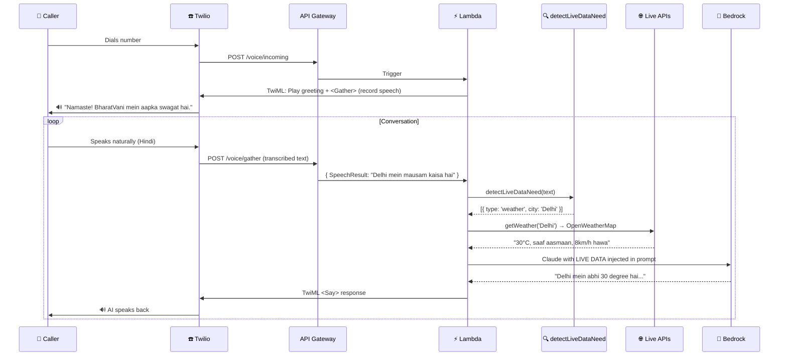
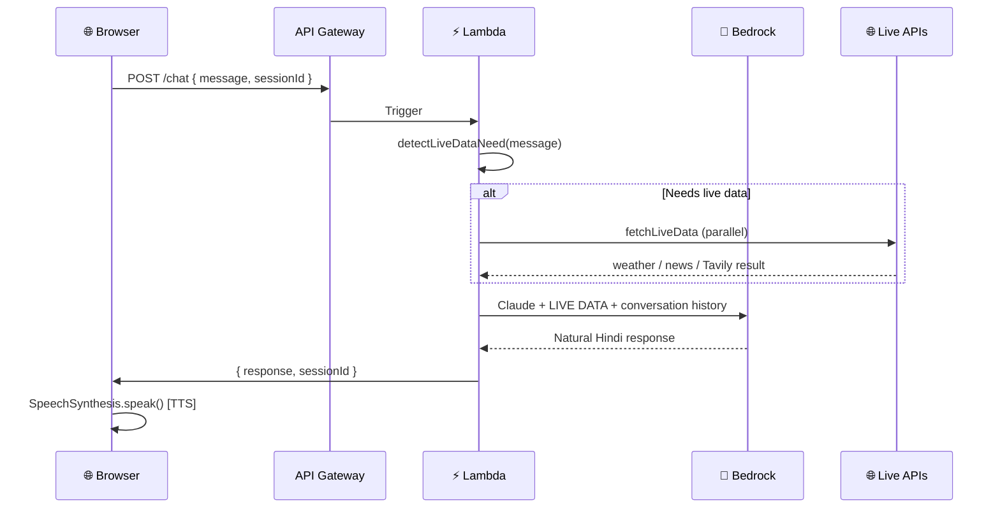

# BharatVani — System Architecture

> **Voice of India** — Any phone. Any language. Any service. Just a call.

> ⚠️ **This document reflects the CURRENT actual implementation as of March 2026.**

---

## 1. High-Level Architecture



---

## 2. Actual Call Flow (Twilio Voice)



---

## 3. Web Chat / Browser Call Flow



---

## 4. Lambda Orchestrator — Internal Logic

The **single Lambda function** handles everything:

```
lambda/orchestrator/
├── index.mjs           ← Main entry: routes /voice/incoming, /voice/gather, /chat
├── handlers/
│   ├── twilio.mjs      ← Builds TwiML for Twilio voice flow
│   ├── govtSchemes.mjs ← Government scheme lookup
│   └── farmerAssistant.mjs ← Crop, weather, farming queries
└── utils/
    ├── apiServices.mjs ← Intent detection + all live API calls
    ├── bedrock.mjs     ← Claude prompt builder + Bedrock call
    ├── session.mjs     ← DynamoDB read/write
    └── sms.mjs         ← OTP / confirmation SMS
```

### Route Map

| Route | Method | Handler | Purpose |
|---|---|---|---|
| `/voice/incoming` | POST | `handleIncoming()` | First call — play greeting |
| `/voice/gather` | POST | `handleGather()` | Receives spoken text, returns AI response |
| `/chat` | POST | inline | Web chat — text in, text out |

---

## 5. Intent Detection — `detectLiveDataNeed()`

**Location:** `lambda/orchestrator/utils/apiServices.mjs`

**Type:** Hardcoded keyword matching (NOT an AI agent)

```javascript
detectLiveDataNeed(userText) → Array<{ type, city?, query? }>
```

| Detected Intent | Keywords (Latin + Devanagari) | API Called |
|---|---|---|
| `weather` | mausam, weather, barish, मौसम, बारिश, ठंड... | OpenWeatherMap |
| `news` | khabar, news, samachar, खबर, समाचार... | NDTV India RSS |
| `gold` | sone, sona, gold, सोना, चांदी... | Tavily search |
| `web_search` | petrol, train, naukri, yojana, पेट्रोल, रेल, नौकरी... | Tavily search |
| (none) | anything else | Claude answers from knowledge base |

> ⚠️ Keywords exist in **both scripts** because browser STT (`hi-IN`) returns Devanagari, while typed input uses Latin.

---

## 6. `bedrock.mjs` — Prompt Architecture

```
buildPrompt(userText, history, language, liveData)
    ↓
system_prompt.txt
  + {SCHEME_CONTEXT}   ← scheme names from S3 knowledge base
  + {AGRICULTURE_CONTEXT}
  + LIVE DATA section  ← weather / news / Tavily result injected here
  + Recent conversation history (last 6 turns)
  + Language: hi-IN
    ↓
Claude 3.5 Sonnet (APAC)
  max_tokens: 200 (normal) | 400 (with live data)
  temperature: 0.5
```

**Critical rule in system_prompt.txt:**
> When LIVE DATA section is present — Claude MUST use it. Never say "mujhe live data nahi pata" when data is provided.

---

## 7. Live Data APIs

### 7.1 OpenWeatherMap (Weather)

- **Endpoint:** `https://api.openweathermap.org/data/2.5/weather`
- **Key:** `process.env.WEATHER_API_KEY` (read inside function — NOT module-level)
- **Cities:** 50+ Indian cities mapped by name + Devanagari
- **Timeout:** 5s AbortController

### 7.2 NDTV India RSS (News)

- **Endpoint:** `https://feeds.feedburner.com/ndtvnews-india-news`
- **Key:** None (free RSS)
- **Parser:** Safe `indexOf()` string parsing (no regex — was crashing Lambda)
- **Returns:** Top 3 headlines

### 7.3 Tavily AI Search (General Web)

- **Endpoint:** `https://api.tavily.com/search`
- **Key:** `process.env.TAVILY_API_KEY`
- **Search depth:** `advanced`
- **Query augmentation:** `query + ' India ' + today's date`
- **Returns:** AI-generated answer from web

---

## 8. DynamoDB Session Schema

```json
{
  "sessionId": "uuid",
  "createdAt": "ISO timestamp",
  "updatedAt": "ISO timestamp",
  "language": "hi-IN",
  "conversationHistory": [
    { "role": "user", "text": "..." },
    { "role": "assistant", "text": "..." }
  ],
  "ttl": 1234567890
}
```

Sessions expire via DynamoDB TTL (24 hours).

---

## 9. S3 Knowledge Base

**Bucket:** `bharatvani-kb-989240813027-dev`

```
knowledge-base/
├── schemes/
│   ├── pm_kisan.json
│   ├── ayushman_bharat.json
│   ├── pm_awas_yojana.json
│   └── ... (25+ scheme JSONs)
├── agriculture/
│   └── farming_tips.json
└── system/
    ├── system_prompt.txt    ← Claude's personality + LIVE DATA rules
    ├── welcome_messages.json
    └── error_responses.json
```

---

## 10. AWS Infrastructure (SAM Template)

**File:** `infrastructure/template.yaml`

| Resource | Type | Name |
|---|---|---|
| Lambda | `AWS::Serverless::Function` | `BharatVani-Orchestrator-dev` |
| API Gateway | `AWS::Serverless::HttpApi` | Auto-created |
| DynamoDB | `AWS::DynamoDB::Table` | `BharatVani-Sessions-dev` |
| S3 | `AWS::S3::Bucket` | `bharatvani-kb-989240813027-dev` |

**Lambda env vars:**

| Var | Value |
|---|---|
| `BEDROCK_MODEL_ID` | `apac.anthropic.claude-3-5-sonnet-20241022-v2:0` |
| `ENVIRONMENT` | `dev` |
| `WEATHER_API_KEY` | OpenWeatherMap key |
| `NEWS_API_KEY` | (kept, unused — RSS is free) |
| `TAVILY_API_KEY` | Tavily search key |

---

## 11. Web Frontend

**Location:** `web/`

| File | Purpose |
|---|---|
| `call.html` | Browser voice call UI — uses Web Speech API for STT + SpeechSynthesis for TTS |
| `chat.html` | Text chat interface for testing |

**call.html TTS fix:** Long responses are split into sentence chunks for `SpeechSynthesisUtterance` to prevent browser truncation.

---

## 12. Deployment

```bash
# Full deploy command
sam build --template-file infrastructure/template.yaml

sam deploy \
  --template-file infrastructure/template.yaml \
  --stack-name bharatvani-stack \
  --region ap-south-1 \
  --resolve-s3 \
  --capabilities CAPABILITY_IAM \
  --no-confirm-changeset \
  --parameter-overrides \
    "Environment=dev \
     BedrockModelId=apac.anthropic.claude-3-5-sonnet-20241022-v2:0 \
     WeatherApiKey=YOUR_KEY \
     NewsApiKey=YOUR_KEY \
     TavilyApiKey=YOUR_KEY"
```

---

## 13. Known Limitations & Future Work

| Limitation | Current Workaround | Future Fix |
|---|---|---|
| Intent detection is keyword-based | 50+ keywords in Latin + Devanagari | Claude tool-calling (agentic routing) |
| Only Hindi supported | `hi-IN` STT + Claude Hindi response | Add Tamil, Telugu, Bengali STT |
| Twilio free trial | Using Twilio trial number | Upgrade or switch to MyOperator |
| Gold API is static | Tavily searches for gold rate | Dedicated gold price API |
| No Bedrock Knowledge Base | Scheme JSONs loaded from S3 into prompt | Migrate to Bedrock KB + RAG |
