# 🏗️ BharatVani — System Design Document

<div align="center">

### भारत वाणी — System Design
**Voice-First Digital Access Platform for India**

*Detailed technical design for the AI for Bharat Hackathon 2026*

[](https://aws.amazon.com/lambda/)
[](https://aws.amazon.com/bedrock/)
[](https://bharatvani.in)

</div>

---

## Table of Contents

1. [Design Philosophy](#1-design-philosophy)
2. [System Architecture](#2-system-architecture)
3. [Conversation Engine Design](#3-conversation-engine-design)
4. [Two-Phase Implementation Strategy](#4-two-phase-implementation-strategy)
5. [Intelligent Routing & Intent Detection](#5-intelligent-routing--intent-detection)
6. [Service Module Architecture](#6-service-module-architecture)
7. [Data Architecture](#7-data-architecture)
8. [Security & Verification Design](#8-security--verification-design)
9. [Multilingual Engine](#9-multilingual-engine)
10. [Demo Application Design](#10-demo-application-design)
11. [Scalability & Cost Model](#11-scalability--cost-model)
12. [Extensibility — Platform Thinking](#12-extensibility--platform-thinking)
13. [Monitoring & Observability](#13-monitoring--observability)
14. [Design Differentiators](#14-design-differentiators)

---

## 1. Design Philosophy

BharatVani is designed around one radical principle:

> **The most accessible interface in India is not a screen — it's a voice call.**

Every architectural decision is driven by four pillars:

| Pillar | Principle | Design Implication |
|---|---|---|
| **Zero Barrier** | No smartphone, no internet, no literacy, no cost | Voice calls over 2G; toll-free number |
| **Voice First** | Conversation, not navigation | AI handles natural speech; no menus unless user prefers |
| **Modular Platform** | Add any service without changing the core | Plugin-based Lambda architecture |
| **Graceful Failure** | Never break the user's trust | Every error becomes a friendly Hindi/regional prompt |

---

## 2. System Architecture

### 2.1 High-Level Architecture

```mermaid
graph TB
    subgraph "User Layer"
        U["📱 Any Phone via Toll-Free Number"]
    end

    subgraph "Ingress Layer"
        TEL["📡 Telecom Network"]
        CON["☎️ Amazon Connect"]
    end

    subgraph "Intelligence Layer"
        STT["🎙️ Amazon Transcribe"]
        AI["🧠 Amazon Bedrock — Claude 3.5 Sonnet"]
        TTS["🔊 Amazon Polly"]
    end

    subgraph "Orchestration Layer"
        ORC["⚡ Lambda: Orchestrator"]
        RTR["🔀 Lambda: Service Router"]
    end

    subgraph "Service Layer — Pluggable Modules"
        QA["💬 General Q&A"]
        GS["🏛️ Govt Schemes"]
        FM["🌾 Farmer Assistant"]
        EC["🛒 E-Commerce"]
        BK["🚂 Booking Services"]
    end

    subgraph "Data Layer"
        DDB["💾 Amazon DynamoDB"]
        S3["📦 Amazon S3 — Knowledge Base"]
    end

    subgraph "Outbound Layer"
        SNS["📩 Amazon SNS — SMS"]
    end

    U --> TEL --> CON
    CON -->|"Audio Stream"| STT
    STT -->|"Transcript"| ORC
    ORC -->|"Prompt + Context"| AI
    AI -->|"Intent + Response"| RTR
    RTR --> QA & GS & FM & EC & BK
    QA & GS & FM & EC & BK --> DDB
    GS & FM --> S3
    RTR -->|"Response Text"| TTS
    TTS -->|"Audio"| CON
    CON --> TEL --> U
    ORC --> SNS -->|"SMS"| U
```

### 2.2 AWS Service Map

| # | AWS Service | Layer | Role | Why This Service |
|---|---|---|---|---|
| 1 | **Amazon Connect** | Ingress | Toll-free IVR, call routing, audio streaming | Purpose-built for contact centers, handles millions of calls |
| 2 | **Amazon Transcribe** | Intelligence | Real-time speech → text (22 Indian languages) | Best-in-class Indian language ASR, streaming mode |
| 3 | **Amazon Bedrock** | Intelligence | AI reasoning — intent detection, response generation | Managed LLM (Claude 3.5), no GPU infra, multilingual |
| 4 | **Amazon Polly** | Intelligence | Text → natural voice | Neural voices (Aditi for Hindi), SSML for natural pauses |
| 5 | **AWS Lambda** | Orchestration | Orchestrator, router, all service module logic | Serverless, pay-per-invocation, auto-scales |
| 6 | **Amazon DynamoDB** | Data | Sessions, user profiles, orders, cached prices | Single-digit ms latency, serverless, TTL auto-cleanup |
| 7 | **Amazon S3** | Data | Knowledge base (schemes, agriculture, products) | Durable, cost-effective, integrates with Bedrock RAG |
| 8 | **Amazon SNS** | Outbound | OTP delivery + transaction confirmation SMS | Reliable pan-India SMS delivery |
| 9 | **CloudWatch** | Monitoring | Logs, metrics, alarms, dashboards | Full operational visibility across all services |
| 10 | **AWS IAM** | Security | Service-to-service authentication | Least-privilege access per Lambda function |

### 2.3 Request Lifecycle

```mermaid
sequenceDiagram
    participant U as 📱 User
    participant AC as ☎️ Connect
    participant TR as 🎙️ Transcribe
    participant ORC as ⚡ Orchestrator
    participant BR as 🧠 Bedrock
    participant MOD as 📦 Service Module
    participant PO as 🔊 Polly
    participant SNS as 📩 SNS

    U->>AC: Dials 1800-BHARAT-VANI
    AC->>ORC: New session event
    ORC->>ORC: Create session in DynamoDB
    AC->>PO: Welcome prompt text
    PO->>AC: Welcome audio
    AC->>U: "Namaste! BharatVani mein swagat hai..."

    loop Every User Utterance
        U->>AC: Speaks naturally
        AC->>TR: Stream audio
        TR->>ORC: Transcribed text
        ORC->>ORC: Load session context from DynamoDB
        ORC->>BR: System prompt + history + user text
        BR->>ORC: Structured response with intent + entities
        ORC->>MOD: Route to appropriate service module
        MOD->>ORC: Service result data
        ORC->>BR: Format result in user's language
        BR->>ORC: Natural language response
        ORC->>PO: Response text
        PO->>AC: Response audio
        AC->>U: AI speaks back
        ORC->>ORC: Update session in DynamoDB
    end

    opt Transaction Completed
        ORC->>SNS: Send confirmation SMS
        SNS->>U: 📩 SMS received
    end

    U->>AC: Hangs up
    AC->>ORC: Session end event
    ORC->>ORC: Save session summary and analytics
```

---

## 3. Conversation Engine Design

### 3.1 Conversation State Machine

Every call follows a deterministic state machine with graceful transitions:

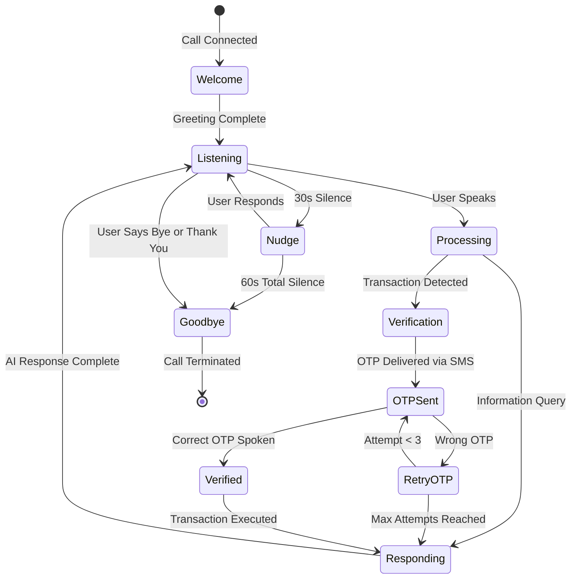

### 3.2 Voice UX Principles

| # | Principle | Rule | Rationale |
|---|---|---|---|
| 1 | **Brevity** | Max 30 words per AI response | Long responses overwhelm on phone; user can't scroll back |
| 2 | **Simplicity** | Use spoken, colloquial language only | Target users don't understand formal/written language |
| 3 | **Confirmation** | Always confirm before irreversible actions | Prevents errors; builds trust |
| 4 | **Recovery** | Never expose technical errors | "Samajh nahi aaya" not "Speech recognition failed" |
| 5 | **Patience** | Allow 30 seconds before nudging | Rural users may take time formulating questions |
| 6 | **Handoff** | Suggest alternatives when AI can't help | "Apne nearest CSC center jaa sakte hain" |

### 3.3 Sample Conversation: Government Scheme Query

```
USER calls → AI picks up

AI: "Namaste! BharatVani mein aapka swagat hai.
     Aap kya jaanna chahte hain?"

USER: "PM-KISAN ke bare mein batao"

AI: "PM-KISAN mein har kisan ko saal mein 6000
     rupaye milte hain, teen installments mein.
     Aur kuch jaanna hai iske bare mein?"

USER: "Main eligible hoon kya?"

AI: "Kya aapke paas kheti ki zameen hai?"

USER: "Haan, 2 acre hai"

AI: "Aap eligible hain! Apply karne ke liye nearest
     CSC center jaayein. Aadhaar, land papers, aur
     bank account chahiye. SMS bhej raha hoon details ke saath."

     [SMS: "PM-KISAN: Aap eligible hain. Documents: Aadhaar,
      Land Papers, Bank Account. Apply: nearest CSC or pmkisan.gov.in
      Helpline: 155261"]

USER: "Dhanyavaad"

AI: "Shukriya! Kisi bhi samay dubara call karein."

→ Call ends
```

### 3.4 Sample Conversation: E-Commerce with OTP

```
USER: "Mujhe phone case chahiye"

AI: "Kaunse phone ke liye?"

USER: "Samsung Galaxy"

AI: "Teen options hain:
     Ek — Silicon case, 299 rupaye
     Do — Leather case, 599 rupaye
     Teen — Clear case, 199 rupaye
     Kaunsa chahiye?"

USER: "Do number wala"

AI: "Leather case, 599 rupaye. Confirm karne ke liye
     aapke phone par OTP bhej raha hoon."

     [SMS: "BharatVani OTP: 4832. Valid for 5 minutes."]

AI: "OTP bataiye."

USER: "4-8-3-2"

AI: "Order confirmed! Leather case, 599 rupaye.
     2-3 din mein deliver hoga. SMS mein order details hain."

     [SMS: "✅ BharatVani Order #BV-0215-001
      Item: Samsung Leather Case
      Amount: ₹599 | Delivery: 2-3 days
      Track: Call 1800-BHARAT-VANI"]
```

---

## 4. Two-Phase Implementation Strategy

### Phase 1 — Knowledge Engine (AI-Powered Q&A)

The AI answers any question using its training knowledge + a curated knowledge base. **No external API dependencies.**

```mermaid
graph LR
    subgraph "Phase 1: Knowledge Engine"
        A["User's Voice Query"] --> B["Bedrock AI"]
        B --> C{"Knowledge Source"}
        C -->|"Open Domain"| D["Bedrock's Built-in Knowledge"]
        C -->|"Govt Schemes"| E["S3 Knowledge Base — RAG"]
        C -->|"Agriculture"| F["S3 Agriculture KB — RAG"]
        D --> G["Voice Response"]
        E --> G
        F --> G
    end
```

**✅ Works instantly** — no API keys, no scraping, no external dependencies.

### Phase 2 — Transaction Engine (Demo App Integration)

We add a **custom demo application** for live transactional demos — fully controlled, zero failure risk.

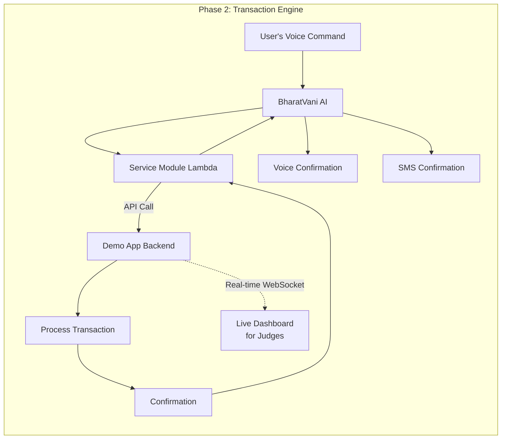

**✅ Demo-safe** — our own backend, our own data, our own rules. No third-party surprises.

---

## 5. Intelligent Routing & Intent Detection

### 5.1 Intent Taxonomy

```mermaid
graph TD
    A["User Utterance"] --> B["🧠 Bedrock: Classify Intent"]

    B --> I["📖 INFORMATION"]
    B --> T["💳 TRANSACTION"]
    B --> N["🧭 NAVIGATION"]

    I --> I1["general_knowledge"]
    I --> I2["govt_scheme_info"]
    I --> I3["govt_scheme_eligibility"]
    I --> I4["crop_price"]
    I --> I5["weather_forecast"]
    I --> I6["farming_advice"]

    T --> T1["place_order"]
    T --> T2["track_order"]
    T --> T3["book_service"]
    T --> T4["cancel_order"]

    N --> N1["change_language"]
    N --> N2["repeat_last"]
    N --> N3["go_back"]
    N --> N4["end_call"]
    N --> N5["help"]
```

### 5.2 Bedrock Structured Output Format

Every Bedrock call returns both a human response AND machine-readable metadata:

```json
{
  "intent": "govt_scheme_info",
  "confidence": 0.96,
  "category": "INFORMATION",
  "entities": {
    "scheme_name": "pm_kisan",
    "query_type": "benefits"
  },
  "needs_verification": false,
  "response_text": "PM-KISAN mein kisan ko saal mein 6000 rupaye milte hain, teen installments mein.",
  "follow_up": "Kya aap eligibility check karna chahte hain?",
  "sms_content": null
}
```

The structured output enables:
- **Precise routing** — no regex parsing, no keyword matching
- **Verification gating** — transactions automatically trigger OTP
- **Follow-up prompts** — conversational continuity
- **SMS generation** — when action needs written confirmation

---

## 6. Service Module Architecture

Each service is an **independent, stateless Lambda function** — making the system truly pluggable.

### 6.1 Module Interface Contract

Every service module follows the same interface:

```
INPUT:
  - intent (string): Classified intent from Bedrock
  - entities (object): Extracted entities
  - session (object): Full session context
  - user (object): User profile (if returning user)

OUTPUT:
  - response_data (object): Structured result
  - response_text (string): Pre-formatted text for Polly
  - sms_content (string|null): SMS to send
  - next_state (string): Suggested next conversation state
```

### 6.2 Government Schemes Module

```mermaid
graph TD
    A["User Query + Intent"] --> B["Load scheme from S3 KB"]
    B --> C{"Query Type"}
    C -->|"What is it?"| D["Return: name, benefit, overview"]
    C -->|"Am I eligible?"| E["Ask qualifying questions<br/>via multi-turn conversation"]
    C -->|"How to apply?"| F["Return: steps, documents,<br/>nearest CSC, helpline"]
    C -->|"What documents?"| G["Return: required documents list"]
    E --> H["Evaluate against<br/>eligibility rules"]
    H -->|"Eligible"| I["✅ Confirm + guide to apply"]
    H -->|"Not Eligible"| J["❌ Explain why + suggest alternatives"]
```

**Knowledge base:** 30+ schemes in structured JSON, stored in S3, injected into Bedrock prompt via RAG.

### 6.3 Farmer Assistant Module

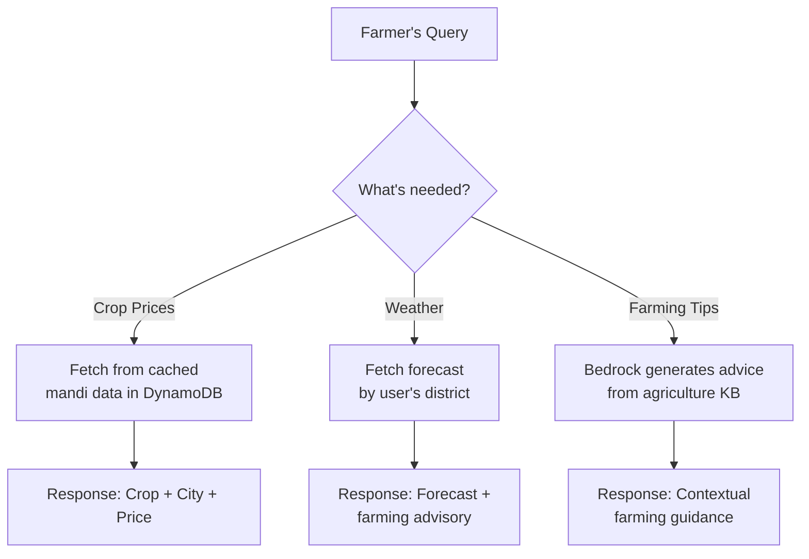

### 6.4 E-Commerce Module

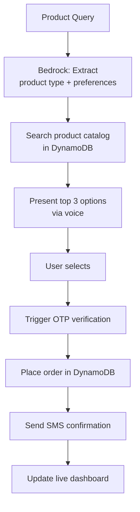

---

## 7. Data Architecture

### 7.1 DynamoDB Table Design

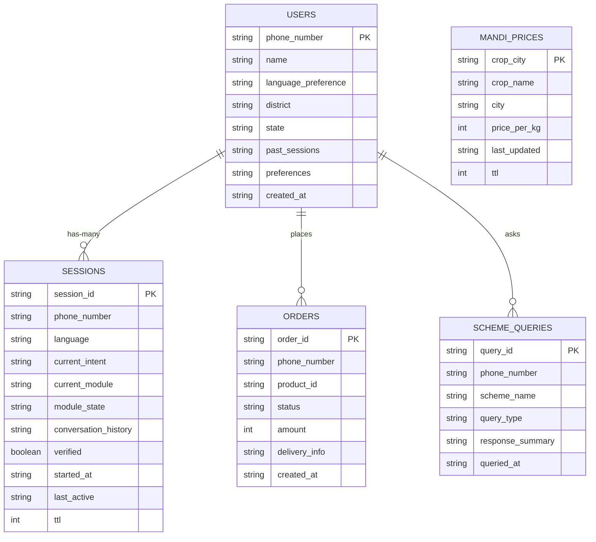

### 7.2 S3 Knowledge Base Structure

```
bharatvani-knowledge-base/
│
├── schemes/                          # 30+ government schemes
│   ├── pm_kisan.json
│   ├── ayushman_bharat.json
│   ├── ujjwala_yojana.json
│   ├── pm_awas_yojana.json
│   ├── sukanya_samriddhi.json
│   └── ...
│
├── agriculture/                      # Farming knowledge
│   ├── crop_calendar.json
│   ├── farming_tips.json
│   └── regional_crops.json
│
├── products/                         # Demo e-commerce catalog
│   └── catalog.json
│
└── system/                           # System prompts & templates
    ├── system_prompt.txt
    ├── welcome_messages.json
    └── error_responses.json
```

---

## 8. Security & Verification Design

### 8.1 Tiered Verification Model

```mermaid
graph TD
    A["Incoming Request"] --> B{"Action Type"}

    B -->|"🔓 Information Query<br/>(scheme info, prices, Q&A)"| C["NO VERIFICATION<br/>Respond immediately"]

    B -->|"🔐 Transaction<br/>(order, booking, personal data)"| D["OTP VERIFICATION REQUIRED"]

    D --> E["Generate 4-digit OTP"]
    E --> F["Store hashed OTP<br/>DynamoDB TTL=5min"]
    F --> G["Send via SNS SMS"]
    G --> H["Polly: 'OTP bataiye'"]
    H --> I["User speaks OTP"]

    I --> J{"Validate"}
    J -->|"✅ Match"| K["Mark session verified<br/>Execute transaction"]
    J -->|"❌ Wrong, attempt<3"| L["'Galat OTP, dobara bataiye'"]
    J -->|"❌ Wrong, attempt=3"| M["'Kripya baad mein call karein'"]

    L --> H
```

### 8.2 Privacy-by-Design

| Data Type | Policy | Implementation |
|---|---|---|
| Phone number | Stored (identity) | Used as primary key for user profiles |
| Conversation audio | **Never stored** | Processed in real-time, discarded |
| Conversation text | Session-scoped | Auto-deleted via DynamoDB TTL (24h) |
| OTPs | Hashed, ephemeral | Auto-deleted after 5 minutes |
| Aadhaar / Bank details | **Never stored** | Processed in Lambda memory only |
| Order data | Stored with consent | Retained for order tracking |

---

## 9. Multilingual Engine

### 9.1 Language Detection Pipeline

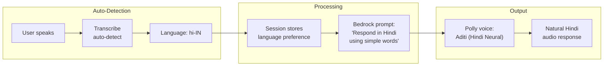

### 9.2 Language Support Roadmap

| Phase | Languages | Population Coverage |
|---|---|---|
| **Phase 1** (Hackathon) | Hindi, English | ~60% |
| **Phase 2** (3 months) | + Tamil, Telugu, Bengali, Marathi | ~85% |
| **Phase 3** (6 months) | + Gujarati, Kannada, Malayalam, Punjabi | ~95% |
| **Phase 4** (1 year) | + Odia, Assamese, Urdu, and more | ~99% |

### 9.3 Code-Mixing Intelligence

Indian users naturally mix languages. BharatVani handles this seamlessly:

| User Says (Mixed) | AI Understands | Intent |
|---|---|---|
| "Mujhe train ticket book karna hai" | Book train ticket | `book_service` |
| "PM-KISAN ka status check karo" | Check PM-KISAN status | `govt_scheme_info` |
| "Kal weather kaisa rahega Patna mein?" | Weather forecast for Patna | `weather_forecast` |
| "Samsung ka phone cover dikhao" | Show Samsung phone covers | `place_order` |

---

## 10. Demo Application Design

### 10.1 Purpose

For the hackathon, we build a **live dashboard application** that runs alongside the voice demo. While the user speaks on a phone, judges can see everything happening in real-time on screen.

### 10.2 Dashboard Architecture

```mermaid
graph TB
    subgraph "Voice Channel (what judges hear)"
        PHONE["📱 Feature Phone"]
        BV["BharatVani AI"]
        PHONE <--> BV
    end

    subgraph "Visual Channel (what judges see)"
        API["API Gateway + Lambda"]
        WEB["📊 Live Dashboard"]
        DDB["DynamoDB Streams"]
    end

    BV -->|"API calls"| API
    API --> DDB
    DDB -->|"Real-time stream"| WEB
```

### 10.3 What Judges See on the Dashboard

```
┌─────────────────────────────────────────────────────────┐
│  BHARATVANI — LIVE DEMO DASHBOARD           🟢 Active   │
├─────────────────────────────────────────────────────────┤
│                                                         │
│  📞 Call Status: ACTIVE | Duration: 01:42               │
│  🌐 Language: Hindi (auto-detected)                     │
│  👤 Caller: +91-XXXXX-XX890                             │
│                                                         │
│  ─── Live Conversation ───────────────────────────────  │
│                                                         │
│  👤 User: "Mujhe Samsung ka phone case chahiye"         │
│  🤖 AI:   Intent: place_order (confidence: 0.97)       │
│           "Kaunse model ke liye?"                        │
│                                                         │
│  👤 User: "Galaxy M34"                                  │
│  🤖 AI:   Searching catalog... 3 results found          │
│           "Teen options hain..."                        │
│                                                         │
│  ─── Order Status ────────────────────────────────────  │
│                                                         │
│  📦 Order #BV-0215-001                                  │
│  Status: ⏳ Awaiting OTP verification                    │
│  Item: Samsung Galaxy M34 Leather Case                  │
│  Amount: ₹599                                           │
│                                                         │
│  ─── OTP Verification ───────────────────────────────   │
│                                                         │
│  📩 OTP Sent: ✅ (4832)                                  │
│  🔊 User spoke: "4-8-3-2"                              │
│  ✅ Verified: Order Confirmed!                           │
│  📩 SMS Sent: ✅                                         │
│                                                         │
└─────────────────────────────────────────────────────────┘
```

> **This creates the "wow" moment** — judges hear the AI conversation on the phone AND see the backend processing, order creation, and verification happening live on screen, simultaneously.

---

## 11. Scalability & Cost Model

### 11.1 Serverless Auto-Scaling

| Component | Scaling Behavior | Capacity Limit |
|---|---|---|
| Amazon Connect | Auto-scales with concurrent calls | Thousands of concurrent calls |
| AWS Lambda | New instance per request | Thousands per second |
| DynamoDB | On-demand capacity mode | Unlimited reads/writes |
| Bedrock | Managed, no capacity planning | Token-based pricing |
| SNS | Auto-scales SMS delivery | Unlimited |

**Zero servers. Zero capacity planning. Zero DevOps.**

### 11.2 Per-Call Cost Breakdown

| Component | Cost (3-min average call) |
|---|---|
| Amazon Connect (IVR) | ₹0.50 |
| Amazon Transcribe (3 min streaming) | ₹0.40 |
| Amazon Bedrock (3-4 turns) | ₹0.30 |
| Amazon Polly (neural TTS) | ₹0.10 |
| Lambda + DynamoDB | ₹0.05 |
| SNS (1-2 SMS) | ₹0.10 |
| **Total per call** | **₹1.45** |

### 11.3 Revenue vs Cost at Scale

| Stage | Daily Calls | Monthly AWS Cost | Monthly Revenue | Margin |
|---|---|---|---|---|
| **Pilot** | 1,000 | ₹44,000 | — | Funded by grants |
| **Launch** | 1,00,000 | ₹44,00,000 | ₹60,00,000 | 26% |
| **Scale** | 10,00,000 | ₹4,40,00,000 | ₹15,00,00,000 | 70% |

**Revenue sources:** Government subscription (₹10/user/month from Digital India budget) + Transaction fees (₹2/txn paid by service providers) + Sponsored services.

**Users always pay ₹0.**

---

## 12. Extensibility — Platform Thinking

BharatVani is not a single-purpose tool. It's a **voice platform** where any service can plug in.

### 12.1 Adding a New Service: 4 Steps

```mermaid
graph LR
    A["1. Write Lambda<br/>with service logic"] --> B["2. Register intent<br/>in Router config"]
    B --> C["3. Upload knowledge<br/>to S3 if needed"]
    C --> D["4. Update Bedrock<br/>system prompt"]
    D --> E["✅ Live!"]
```

**Time to add a new service: ~2 hours.** No core system changes.

### 12.2 Service Roadmap

```
 HACKATHON (NOW)              3 MONTHS                    1 YEAR
 ────────────────            ────────────────             ────────────────
 ✅ General Q&A              💳 Banking (balance,         🏥 Telemedicine
 ✅ Govt Schemes                  transfers)              📚 Education Portal
 ✅ Farmer Assistant         📋 Ration Card Status        🏦 Loan Applications
 ✅ E-Commerce Demo          💼 Job Listings              🚌 Bus/Flight Booking
                             🔧 Skill India Training      🏠 Land Registry
                             📱 Mobile Recharge            🆔 Digital Locker
```

Every new service is **one Lambda + one S3 file + one intent mapping** away from production.

---

## 13. Monitoring & Observability

### 13.1 CloudWatch Dashboard

| Metric | What It Tells Us | Alert Threshold |
|---|---|---|
| Call Volume (per minute) | System load | > 500/min → scale warning |
| Avg Response Latency | User experience quality | > 4 sec → investigate |
| Transcription Accuracy | Speech recognition quality | < 85% → model issue |
| Intent Confidence (avg) | AI understanding quality | < 0.80 → prompt tuning needed |
| OTP Success Rate | Verification flow health | < 90% → delivery issue |
| Error Rate (Lambda) | System health | > 2% → alert |
| Session Duration (avg) | User engagement | Baseline tracking |

### 13.2 Logging Strategy

| Event | Logged Data | Purpose |
|---|---|---|
| Call Start | phone_number, timestamp, language_detected | Analytics |
| Each Turn | intent, confidence, response_length, latency | Quality monitoring |
| Verification | OTP_sent, OTP_result, attempts | Security audit |
| Call End | duration, turns, intents_used, outcome | Product analytics |
| Errors | error_type, service, stack_trace | Debugging |

---

## 14. Design Differentiators

### Why This Design Wins

| Evaluation Criteria | BharatVani's Strength |
|---|---|
| **Innovation** | First voice-first internet access platform — no equivalent exists globally |
| **AWS Depth** | 10 AWS services in purposeful integration — not superficial usage |
| **Technical Rigor** | Stateful conversation engine, structured intent routing, RAG-powered knowledge, OTP verification — production-grade architecture |
| **Social Impact** | 700M people gaining digital access — the single largest inclusion opportunity in the world |
| **Feasibility** | Works TODAY on existing phones and networks — no new infrastructure needed |
| **Scalability** | 100% serverless — scales from 1 to 10M calls with zero architecture changes |
| **Business Viability** | Government-aligned, budget available (Digital India), profitable unit economics |
| **Extensibility** | New service in 2 hours — platform, not product |
| **Demo Quality** | Live voice demo on Nokia phone + real-time dashboard = unforgettable |

### What Makes Us Different From Every Other Entry

```
 OTHER TEAMS                           BHARATVANI
 ──────────────                        ──────────────
 Build another app                     Works WITHOUT an app
 Require smartphone                    Works on ₹500 phone
 Need internet                         Works on 2G voice call
 Require literacy                      100% voice-based
 Serve existing users better            Serve 700M NEW users
 Incremental improvement               Category creation
```

> **We're not competing with other apps. We're in a category of our own.**

---

<div align="center">

### 🏆 BharatVani — The Internet, Spoken.

*Designed for 700 million Indians who deserve digital access.*

**Team BharatVani** | AI for Bharat Hackathon 2026

*Built entirely on AWS — Amazon Connect • Bedrock • Transcribe • Polly • Lambda • DynamoDB • S3 • SNS • CloudWatch • IAM*

</div>
