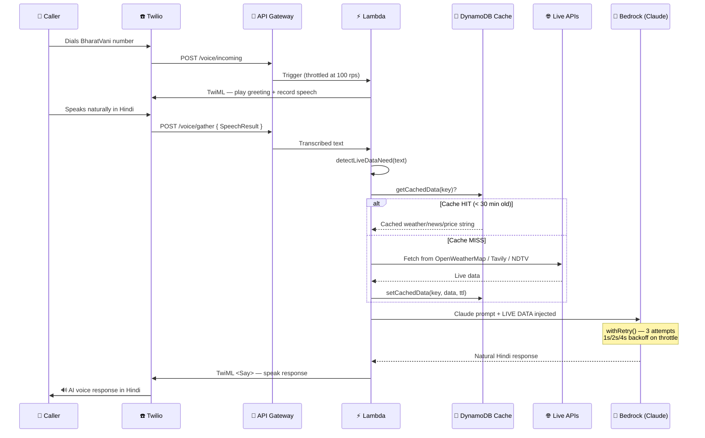
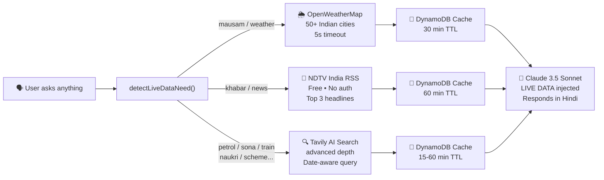

<div align="center">

<br/>

```
██████╗ ██╗  ██╗ █████╗ ██████╗  █████╗ ████████╗    ██╗   ██╗ █████╗ ███╗   ██╗██╗
██╔══██╗██║  ██║██╔══██╗██╔══██╗██╔══██╗╚══██╔══╝    ██║   ██║██╔══██╗████╗  ██║██║
██████╔╝███████║███████║██████╔╝███████║   ██║       ██║   ██║███████║██╔██╗ ██║██║
██╔══██╗██╔══██║██╔══██║██╔══██╗██╔══██║   ██║       ╚██╗ ██╔╝██╔══██║██║╚██╗██║██║
██████╔╝██║  ██║██║  ██║██║  ██║██║  ██║   ██║        ╚████╔╝ ██║  ██║██║ ╚████║██║
╚═════╝ ╚═╝  ╚═╝╚═╝  ╚═╝╚═╝  ╚═╝╚═╝  ╚═╝   ╚═╝          ╚═══╝  ╚═╝  ╚═╝╚═╝  ╚═══╝╚═╝
```

### 🇮🇳 *भारत वाणी — Voice of a Billion Indians*

**The internet, spoken. In every language. On any phone. For free.**

*Powered by Amazon Bedrock · Built on AWS · Made for Bharat*

---

[](https://aws.amazon.com/bedrock/)
[](https://aws.amazon.com/lambda/)
[](https://aws.amazon.com/dynamodb/)
[](https://aws.amazon.com/xray/)
[](https://twilio.com)
[](#live-data-pipeline)

</div>

---

## 📞 One Number. Every Indian.

```
                    ┌──────────────────────────────────────┐
                    │                                      │
  👨‍🌾 Ramesh          │  "Namaskar! Main BharatVani hoon.    │
  Bihar farmer  ──► │   Aap kya jaanna chahte hain?"       │
  (₹500 phone)      │                                      │
                    │  "PM-KISAN ka form kaise bharen?"    │
  ◄─ answers in ────│                                      │
     Hindi, in      │  "Naya ration card banana hai?"      │
     under 3 sec    │                                      │
                    │  "Aaj Delhi mein mausam kaisa hai?"  │
                    │                                      │
                    └──────────────────────────────────────┘
              No internet. No smartphone. No literacy needed.
```

> **Ramesh calls from a ₹500 feature phone on 2G. BharatVani answers in flawless Hindi with real, live information — in seconds.**

---

## 🔴 The Problem We're Solving

<div align="center">

### India's digital revolution left **700 million people behind.**

</div>

| The Barrier | Scale | Why Everything Else Fails |
|---|---|---|
| 📵 **No Smartphone** | 700 million people | Every app needs Android/iOS |
| 🌐 **No Internet** | 350 million+ | Every service needs data |
| 📖 **Can't Read/Write** | 260 million adults | All digital is text-based |
| 🗣️ **No English** | 500 million+ | Most apps are English-first |
| 👴 **Elderly & Disabled** | 160 million+ | Touchscreens are a barrier |

> *A farmer checking PM-KISAN eligibility has to travel 5 km, stand in a queue for 2 hours, and lose ₹500 in wages — when the answer is one phone call away.*

---

## 🟢 Our Vision

**BharatVani is not an app. It is a phone number.**

A phone number that understands you — in Hindi, in your own words, the way you actually speak. It connects to live data, government databases, and the full knowledge of the internet — and speaks the answer back to you, instantly.

```
The Vision: A single phone number that IS the internet for 700 million Indians.
```

We believe **voice is the great equalizer** — the one interface every human being already knows how to use. No training required. No literacy required. No smartphone required.

BharatVani is the **last-mile layer** that connects India's most excluded citizens to digital India.

---

## ✨ What BharatVani Does Today — Live

| Category | What You Can Ask | Data Source | Status |
|---|---|---|---|
| 🌦️ **Live Weather** | "Delhi mein aaj mausam kaisa hai?" | OpenWeatherMap API | ✅ Live |
| 📰 **Live News** | "Aaj ki taza khabar kya hai?" | NDTV India RSS Feed | ✅ Live |
| ⛽ **Petrol / Diesel Price** | "Mumbai mein petrol ka rate kya hai?" | Tavily AI Web Search | ✅ Live |
| 🚂 **Train Info** | "Delhi se Patna train kab aati hai?" | Tavily AI Web Search | ✅ Live |
| 🥇 **Gold / Silver Rate** | "Aaj sone ka bhav kya hai?" | Tavily AI Web Search | ✅ Live |
| 🏛️ **Government Schemes** | "PM-KISAN mein kitna paisa milta hai?" | Local Knowledge Base (25+ schemes) | ✅ Live |
| 💼 **Jobs / Naukri** | "Sarkari naukri ki vacancy kab nikalti hai?" | Tavily AI Web Search | ✅ Live |
| 🌾 **Agriculture / Mandi** | "Gehun ka aaj ka rate kya hai?" | Tavily AI Web Search | ✅ Live |
| 💊 **Health Schemes** | "Ayushman Bharat mein kya kya hota hai?" | Local Knowledge Base | ✅ Live |
| 💬 **Anything Else** | Any question, in any phrasing | Claude 3.5 Sonnet AI | ✅ Live |

---

## 🏗️ System Architecture

### High-Level Overview

```
                                    ┌────────────────────────────────────┐
  📱 Any Phone                      │          AWS Cloud                 │
  (2G/3G/4G)                        │                                    │
       │                            │  ┌──────────┐    ┌─────────────┐  │
       │  dials number              │  │   API     │    │   Lambda    │  │
       ▼                            │  │  Gateway  │───►│ Orchestrator│  │
  ┌─────────┐                       │  │ (throttle)│    │  (X-Ray ✓) │  │
  │ Twilio  │──── webhook POST ────►│  └──────────┘    └──────┬──────┘  │
  │  Voice  │◄─── TwiML response ───│                         │         │
  └─────────┘                       │              ┌──────────┼──────┐  │
       │                            │              ▼          ▼      ▼  │
       │ 🗣️ User speaks            │         ┌────────┐  ┌──────┐ ┌───┐ │
       │ 🔊 AI responds            │         │Bedrock │  │  S3  │ │DDB│ │
                                    │         │Claude  │  │ KB   │ │   │ │
                                    │         │3.5 APAC│  │25+   │ │4  │ │
                                    │         └────────┘  │schms │ │tbl│ │
                                    │              │       └──────┘ └───┘ │
                                    │    ┌─────────┴──────────┐          │
                                    │    │   Live Data Layer  │          │
                                    │    │  ☁ OpenWeatherMap  │          │
                                    │    │  🔍 Tavily Search  │          │
                                    │    │  📰 NDTV RSS Feed  │          │
                                    │    └────────────────────┘          │
                                    └────────────────────────────────────┘
```

### Request Flow (Step by Step)


```mermaid
sequenceDiagram
    participant U as 📱 Caller
    participant TW as ☎️ Twilio
    participant AG as 🔌 API Gateway
    participant LM as ⚡ Lambda
    participant DDB as 💾 DynamoDB Cache
    participant API as 🌐 Live APIs
    participant BR as 🧠 Bedrock (Claude)

    U->>TW: Dials BharatVani number
    TW->>AG: POST /voice/incoming
    AG->>LM: Trigger (throttled at 100 rps)
    LM->>TW: TwiML — play greeting + record speech

    U->>TW: Speaks naturally in Hindi
    TW->>AG: POST /voice/gather { SpeechResult }
    AG->>LM: Transcribed text

    LM->>LM: detectLiveDataNeed(text)
    LM->>DDB: getCachedData(key)?

    alt Cache HIT (< 30 min old)
        DDB-->>LM: Cached weather/news/price string
    else Cache MISS
        LM->>API: Fetch from OpenWeatherMap / Tavily / NDTV
        API-->>LM: Live data
        LM->>DDB: setCachedData(key, data, ttl)
    end

    LM->>BR: Claude prompt + LIVE DATA injected
    Note over BR: withRetry() — 3 attempts<br/>1s/2s/4s backoff on throttle
    BR-->>LM: Natural Hindi response
    LM->>TW: TwiML <Say> — speak response
    TW->>U: 🔊 AI voice response in Hindi
```

---

## ☁️ AWS Services — Complete Map

| AWS Service | How BharatVani Uses It | Why This Service |
|---|---|---|
| 🧠 **Amazon Bedrock** | Powers all AI understanding and response generation using Claude 3.5 Sonnet (APAC cross-region inference profile) | Managed AI, no GPU infra, highest quality multilingual model available |
| ⚡ **AWS Lambda** | Single orchestrator function — handles all call routing, live data fetching, prompt building, and TwiML generation | Serverless: zero servers, infinite scale, pay-per-invocation |
| 🔌 **Amazon API Gateway** | HTTP API exposing `/voice/incoming`, `/voice/gather`, `/chat` with 200 burst / 100 rps throttling | Auto-scaling, built-in throttle, protects Bedrock quota from abuse |
| 💾 **Amazon DynamoDB** | 4 tables: `Sessions` (call history), `Users` (profiles), `QueryLogs` (analytics), `Cache` (API response cache with TTL) | Single-digit ms latency, serverless, TTL auto-cleanup |
| 📦 **Amazon S3** | Knowledge base bucket with 25+ government scheme JSONs loaded into Claude's context per query | Cheap, durable; versioned bucket for safe updates |
| 📊 **Amazon CloudWatch** | Full Lambda monitoring: Errors alarm (>10/5min), Throttles alarm (≥1/min), P95 Duration alarm (>10s) | Operational visibility; alarms fire before users notice problems |
| 🔭 **AWS X-Ray** | Distributed tracing across API Gateway → Lambda → DynamoDB → Bedrock → external APIs | Full call graph visibility; latency per subsystem; critical for prod debugging |
| 📬 **Amazon SQS** | Dead Letter Queue (`BharatVani-DLQ-dev`, 14-day retention) captures failed Lambda invocations | Zero silent failures; every failed call is recoverable and inspectable |
| 📩 **Amazon SNS** | OTP and transaction confirmation SMS (IAM permission ready; wired for verification flows) | Reliable SMS delivery across all Indian operators |
| 🔊 **Amazon Polly** | Neural TTS IAM permission in place for future Amazon Connect integration | Neural Indian voices (Aditi); SSML for natural pauses |
| 🔐 **AWS IAM** | Least-privilege per service: Lambda has minimal permissions, each policy scoped to exact resource ARN | Security by design; no wildcard write permissions |
| 🏗️ **AWS SAM** | Full Infrastructure-as-Code (`infrastructure/template.yaml`) — one deploy command sets up everything | Reproducible, version-controlled, audit-ready infrastructure |

---

## 🛡️ Production-Grade Architecture

BharatVani is designed from the ground up to be production-ready — not just a hackathon demo:

### Reliability

```
┌─────────────────────────────────────────────────────┐
│               RELIABILITY STACK                     │
│                                                     │
│  ┌─────────────────────────────────────────────┐   │
│  │  Bedrock Retry (Exponential Backoff)        │   │
│  │  Attempt 1 → fail → wait 1s                │   │
│  │  Attempt 2 → fail → wait 2s                │   │
│  │  Attempt 3 → fail → CloudWatch alarm fires  │   │
│  └─────────────────────────────────────────────┘   │
│                                                     │
│  ┌─────────────────────────────────────────────┐   │
│  │  DynamoDB API Cache (TTL-based)             │   │
│  │  Weather      → 30 min TTL                 │   │
│  │  News         → 60 min TTL                 │   │
│  │  Prices/Web   → 15 min TTL                 │   │
│  │  Cache miss → live API → write cache       │   │
│  │  Cache fail → non-fatal, falls to live API │   │
│  └─────────────────────────────────────────────┘   │
│                                                     │
│  ┌─────────────────────────────────────────────┐   │
│  │  SQS Dead Letter Queue (14-day retention)   │   │
│  │  Every failed invocation captured           │   │
│  │  Zero silent data loss                      │   │
│  └─────────────────────────────────────────────┘   │
└─────────────────────────────────────────────────────┘
```

### Scalability

```
┌─────────────────────────────────────────────────────┐
│               SCALABILITY STACK                     │
│                                                     │
│  API Gateway Throttling                             │
│  ├── Burst: 200 concurrent requests                 │
│  └── Sustained: 100 requests/second                 │
│                                                     │
│  Lambda                                             │
│  ├── Auto-scales 0 → 10 concurrent (dev limit)     │
│  ├── Production: request quota → 1,000+             │
│  ├── ProvisionedConcurrency: 3 (commented, prod)    │
│  └── ReservedConcurrency: 80% of quota (prod)       │
│                                                     │
│  DynamoDB                                           │
│  ├── PAY_PER_REQUEST — auto-scales to any load      │
│  └── TTL auto-cleanup — no manual maintenance       │
└─────────────────────────────────────────────────────┘
```

### Observability

```
┌─────────────────────────────────────────────────────┐
│             OBSERVABILITY STACK                     │
│                                                     │
│  AWS X-Ray — Full Distributed Tracing               │
│  API GW → Lambda → DDB → Bedrock → External APIs   │
│                                                     │
│  CloudWatch Alarms (3 active):                      │
│  🔴 LambdaErrors    — fires if errors > 10 / 5min  │
│  🟡 LambdaThrottles — fires on any throttle         │
│  🟠 LambdaDuration  — fires if P95 latency > 10s   │
└─────────────────────────────────────────────────────┘
```

---

## 🌐 Live Data Pipeline


```mermaid
graph LR
    U["🗣️ User asks anything"] --> D["detectLiveDataNeed()"]
    D -->|"mausam / weather"| W["🌦️ OpenWeatherMap\n50+ Indian cities\n5s timeout"]
    D -->|"khabar / news"| N["📰 NDTV India RSS\nFree • No auth\nTop 3 headlines"]
    D -->|"petrol / sona / train\nnaukri / scheme..."| T["🔍 Tavily AI Search\nadvanced depth\nDate-aware query"]
    W --> C["💾 DynamoDB Cache\n30 min TTL"]
    N --> C2["💾 DynamoDB Cache\n60 min TTL"]
    T --> C3["💾 DynamoDB Cache\n15-60 min TTL"]
    C --> P["🧠 Claude 3.5 Sonnet\nLIVE DATA injected\nResponds in Hindi"]
    C2 --> P
    C3 --> P
```

**Query augmentation:** Every Tavily search automatically appends `India` + today's date to maximize relevance of results.

**Keywords detected in both scripts:** `petrol / पेट्रोल`, `mausam / मौसम`, `sona / सोना`, `train / ट्रेन` — because Twilio STT returns Devanagari for `hi-IN` locale.

---

## 🗣️ Language & Voice

| | Today | Roadmap Phase 2 |
|---|---|---|
| **Input (STT)** | Hindi `hi-IN` (Devanagari), English | Tamil, Telugu, Bengali, Marathi |
| **Processing** | Claude 3.5 Sonnet — native multilingual | Same — Claude handles all |
| **Output (TTS)** | Twilio `hi-IN` neural voice | Amazon Polly + Connect integration |
| **Code-mixing** | ✅ Supported — "Mujhe train *book* karna hai" | ✅ Always |

---

## 📂 Repository Structure

```
BharatVani/
│
├── infrastructure/
│   └── template.yaml              ← AWS SAM — complete infra as code
│                                    (Lambda, API GW, 4x DynamoDB, S3, SQS, CloudWatch Alarms, X-Ray)
│
├── lambda/orchestrator/           ← Single Lambda — all logic here
│   ├── index.mjs                  ← Main handler (routes: /voice/incoming, /voice/gather, /chat)
│   ├── handlers/
│   │   ├── twilio.mjs             ← TwiML voice flow builder
│   │   ├── govtSchemes.mjs        ← Government scheme lookup
│   │   └── farmerAssistant.mjs    ← Agriculture & crop queries
│   └── utils/
│       ├── bedrock.mjs            ← Claude integration + withRetry() backoff
│       ├── apiServices.mjs        ← DynamoDB cache + Weather/News/Tavily fetchers
│       ├── session.mjs            ← DynamoDB session CRUD
│       └── sms.mjs                ← SMS via Amazon SNS
│
├── knowledge-base/
│   ├── schemes/                   ← 25+ government scheme JSONs
│   │   ├── pm_kisan.json          ← PM-KISAN Samman Nidhi
│   │   ├── ayushman_bharat.json   ← Health insurance scheme
│   │   ├── pm_awas_yojana.json    ← Housing scheme
│   │   └── ...23 more schemes
│   ├── agriculture/               ← Farming knowledge base
│   └── system/
│       ├── system_prompt.txt      ← Claude's identity, rules, and LIVE DATA directives
│       ├── welcome_messages.json  ← Greeting variations
│       └── error_responses.json   ← Graceful failure messages
│
└── web/
    ├── chat.html                  ← Web chat interface (testing)
    └── call.html                  ← Browser voice call (Web Speech API)
```

---

## 🚀 Deploy in One Command

```bash
# Clone
git clone https://github.com/piyush-lingwal/BharatVani.git
cd BharatVani

# Build + Deploy (replace with your keys)
sam build --template-file infrastructure/template.yaml

sam deploy \
  --template-file infrastructure/template.yaml \
  --stack-name bharatvani-stack \
  --region ap-south-1 \
  --resolve-s3 \
  --capabilities CAPABILITY_IAM \
  --no-confirm-changeset \
  --parameter-overrides \
    "Environment=dev \
     BedrockModelId=apac.anthropic.claude-3-5-sonnet-20241022-v2:0 \
     WeatherApiKey=YOUR_OPENWEATHER_KEY \
     TavilyApiKey=YOUR_TAVILY_KEY"
```

That single `sam deploy` creates **12 AWS resources** automatically:
- 4 DynamoDB tables (Sessions, Users, QueryLogs, Cache)
- 1 S3 bucket (Knowledge Base)
- 1 Lambda function (X-Ray enabled)
- 1 API Gateway (with throttling)
- 1 SQS queue (DLQ)
- 3 CloudWatch alarms
- All IAM roles and policies

### Connect Twilio Phone Number

```
Twilio Console → Phone Numbers → Your Number → Voice Webhook
URL: https://<API-GW>.execute-api.ap-south-1.amazonaws.com/voice/incoming
Method: HTTP POST
```

---

## 📊 Live Endpoints

| Endpoint | Method | Purpose |
|---|---|---|
| `/voice/incoming` | POST | Twilio webhook — call starts |
| `/voice/gather` | POST | Twilio webhook — receives spoken text |
| `/voice/health` | GET | Health check |
| `/chat` | POST | Web chat interface |

**Base URL:** `https://p37tglqhc0.execute-api.ap-south-1.amazonaws.com`

---

## 🗓️ Roadmap

| Phase | Status | What |
|---|---|---|
| **Phase 1 — MVP** | ✅ Complete | AI voice call + Hindi + Govt Schemes + Weather/News + Tavily |
| **Phase 2 — Production Infra** | ✅ Complete | DynamoDB Cache + X-Ray + CloudWatch + SQS DLQ + API Throttling |
| **Phase 3 — Concurrency** | 📋 Ready (pending quota) | Provisioned Concurrency (no cold starts) + Reserved Concurrency |
| **Phase 4 — Languages** | 📋 Planned | Tamil, Telugu, Bengali, Marathi STT+TTS |
| **Phase 5 — Bedrock KB** | 📋 Planned | Migrate to Amazon Bedrock Knowledge Base + RAG |
| **Phase 6 — Connect** | 📋 Planned | Amazon Connect + Transcribe + Polly (full AWS voice stack) |
| **Phase 7 — Scale** | 📋 Planned | 3 states pilot, government partnership, 1 lakh+ users |

---

## 💰 Why This Works Economically

**Users pay ₹0.** Revenue comes from the value delivered:

| Revenue Stream | Rate | Projection |
|---|---|---|
| Government subscription | ₹10/user/month via Digital India | ₹10 Cr/month at 1Cr users |
| Transaction fees | ₹2/completion paid by service providers | ₹20L/month at 10L completions |
| Sponsored rural reach | Companies pay for rural channel access | ₹2-5 Cr/month |

**Unit economics:** AWS cost per call ~₹1.50 &nbsp;|&nbsp; Revenue per call ~₹3-5 &nbsp;|&nbsp; **Profitable from Day 1**

---

## 🏆 Why BharatVani Wins

<div align="center">

| Others Build | BharatVani Builds |
|---|---|
| Another app (needs Android) | Works on **any ₹500 phone** |
| Chatbot (needs internet) | Works on **2G voice call** |
| Website (needs literacy) | **100% voice** — zero reading |
| English-first interface | **Hindi-first**, code-mixing supported |
| Serves existing digital users | Reaches **700M who have nothing** |
| Incremental improvement | **Entirely new category** |

</div>

> *We're not competing with other apps. We're in a category of our own.*

---

<div align="center">

## 🇮🇳 *हर फोन। हर भाषा। हर भारतीय।*
### *Every Phone. Every Language. Every Indian.*

**BharatVani gives 700 million Indians the internet they deserve.**
**One phone call at a time.**

---

*Built with ❤️ for Bharat &nbsp;·&nbsp; AWS Hackathon 2026*

[](https://aws.amazon.com/bedrock/)
[](https://aws.amazon.com/lambda/)
[](https://aws.amazon.com/dynamodb/)
[](https://aws.amazon.com/api-gateway/)
[](https://aws.amazon.com/xray/)
[](https://aws.amazon.com/cloudwatch/)
[](https://aws.amazon.com/sqs/)
[](https://aws.amazon.com/s3/)
[](https://twilio.com)

</div>
