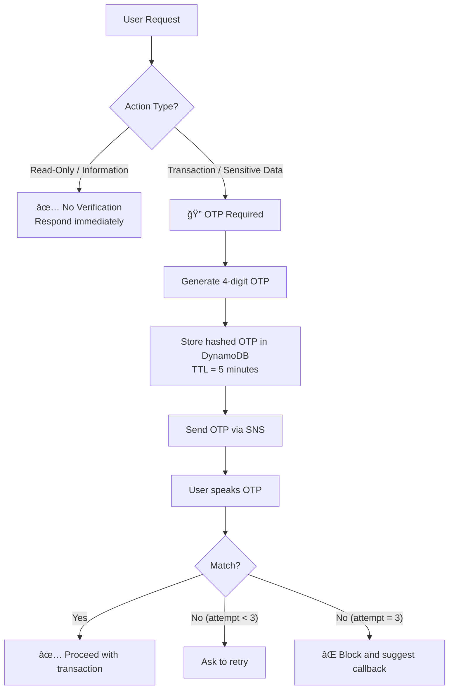
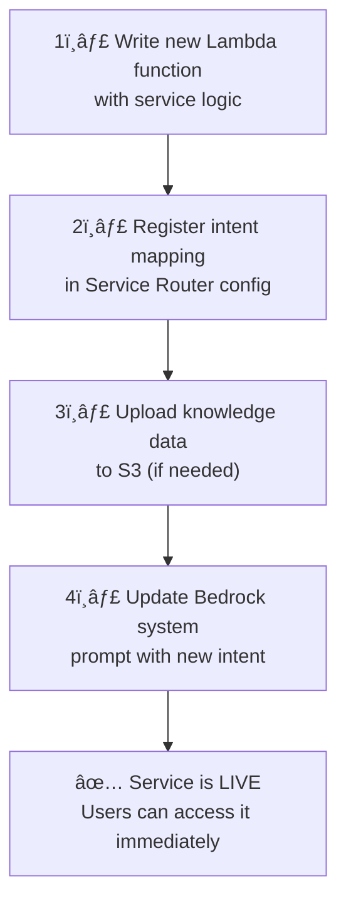

# BharatVani — System Design Document

> **भारत वाणी** — Bridging India's Digital Divide Through Voice AI

---

## 1. Design Philosophy

BharatVani is designed around one radical principle:

> **The most accessible interface in India is not a screen — it's a voice call.**

Every design decision flows from this. We don't ask users to change their behavior, learn new technology, or buy new devices. We meet them where they already are — on a phone call.

### Design Pillars

```
┌──────────────┠ ┌──────────────┠ ┌──────────────┠ ┌──────────────â”
│  ZERO        │  │  VOICE       │  │  MODULAR     │  │  FAIL        │
│  BARRIER     │  │  FIRST       │  │  BY DESIGN   │  │  GRACEFULLY  │
│              │  │              │  │              │  │              │
│  Any phone   │  │  No screens  │  │  Add any     │  │  Never say   │
│  Any network │  │  No typing   │  │  service in  │  │  "error" to  │
│  Zero cost   │  │  No reading  │  │  hours       │  │  the user    │
└──────────────┘  └──────────────┘  └──────────────┘  └──────────────┘
```

---

## 2. High-Level Architecture


---

## 3. Conversation Design

### 3.1 Conversation State Machine

Every call follows a predictable state machine:


### 3.2 Conversation Principles

| Principle | Rule | Example |
|---|---|---|
| **Brevity** | Max 30 words per response | "PM-KISAN mein kisan ko saal mein 6000 rupaye milte hain. Iske liye Aadhaar aur bank account chahiye." |
| **Clarity** | Simple, spoken language only | ✅ "Aapko 6000 rupaye milenge" ⌠"The disbursement amount is INR 6000" |
| **Confirmation** | Always confirm before acting | "Maine 2 kg tamatar ka order laga diya hai. 199 rupaye. Theek hai?" |
| **Recovery** | Never expose errors | ✅ "Samajh nahi aaya, kripya dobara bataiye" ⌠"Speech recognition error" |
| **Handoff** | Suggest alternatives when stuck | "Yeh jaankari abhi available nahi hai. Aap apne nearest CSC center jaa sakte hain." |

### 3.3 Sample Conversation Flows

#### Flow 1: Government Scheme Query (No Verification)

```
USER: [Dials toll-free number]
  AI: "Namaste! BharatVani mein aapka swagat hai.
       Aap kya jaanna chahte hain?"

USER: "PM-KISAN ke bare mein batao"
  AI: "PM-KISAN mein har kisan ko saal mein 6000 rupaye milte hain,
       teen installments mein. Aur kuch jaanna hai iske bare mein?"

USER: "Main eligible hoon kya?"
  AI: "Kya aapke paas kheti ki zameen hai?"

USER: "Haan, 2 acre hai"
  AI: "Aap eligible hain! Apply karne ke liye apne nearest
       CSC center jaayein ya pmkisan.gov.in par register karein.
       Aadhaar, land papers, aur bank account chahiye."

USER: "Dhanyavaad"
  AI: "Dhanyavaad! BharatVani ko use karne ke liye shukriya.
       Kisi bhi samay dubara call karein."
```

#### Flow 2: E-Commerce Order (With OTP Verification)

```
USER: "Mujhe phone case chahiye"
  AI: "Kaunse phone ke liye?"

USER: "Samsung Galaxy"
  AI: "Teen options hain:
       1. Silicon case — 299 rupaye
       2. Leather case — 599 rupaye
       3. Clear case — 199 rupaye
       Kaunsa chahiye?"

USER: "Leather wala"
  AI: "Leather case, 599 rupaye. Order confirm karne ke liye
       aapke phone par OTP bhej raha hoon."
       [SMS: "BharatVani OTP: 4832"]
  AI: "OTP bataiye jo aapke phone par aaya hai."

USER: "4-8-3-2"
  AI: "Order confirm! Leather case, 599 rupaye.
       2-3 din mein deliver hoga. Order number SMS bhej diya hai."
       [SMS: "BharatVani Order #BV-20260215-001 confirmed.
              Leather Case - ₹599. Delivery: 2-3 days."]
```

---

## 4. Two-Phase Implementation Strategy

### Phase 1: Knowledge Engine (General AI)

In Phase 1, BharatVani acts as a **voice-powered knowledge engine**. The AI answers any question using publicly available information — no external API integrations needed.


**What works in Phase 1:**
- Answer any general question (capital of states, math, health tips, etc.)
- Government scheme information (eligibility, benefits, how to apply)
- Farming advice (crop tips, seasonal guidance)
- Educational content
- No external API dependencies = **100% reliable**

### Phase 2: Transaction Engine (Demo App Integration)

In Phase 2, we add a **demo application** that BharatVani can interact with to complete real transactions — proving the platform can do more than just answer questions.


**Demo App includes:**
- Mock e-commerce store (browse, order, track)
- Mock booking system (trains, appointments)
- Fully controlled environment — **zero external dependencies**
- Clean UI for judges to see real-time updates as the AI places orders

---

## 5. Intent Detection & Routing Design

The AI brain (Bedrock) classifies every user utterance into an intent, then the Service Router dispatches to the correct module.

### Intent Taxonomy


### Bedrock Structured Output

Every Bedrock response includes machine-readable metadata:

```json
{
  "intent": "govt_scheme_query",
  "confidence": 0.95,
  "entities": {
    "scheme": "pm_kisan",
    "query_type": "eligibility"
  },
  "needs_verification": false,
  "response_text": "PM-KISAN mein kisan ko saal mein 6000 rupaye milte hain...",
  "follow_up_prompt": "Kya aap apni eligibility check karna chahte hain?"
}
```

---

## 6. Data Design

### 6.1 Session Lifecycle


### 6.2 Knowledge Base Structure (S3)

```
bharatvani-knowledge-base/
├── schemes/
│   ├── pm_kisan.json
│   ├── ayushman_bharat.json
│   ├── ujjwala_yojana.json
│   ├── pm_awas_yojana.json
│   └── ... (30+ schemes)
├── agriculture/
│   ├── crop_calendar.json
│   ├── farming_tips.json
│   └── regional_crops.json
├── products/
│   └── catalog.json
└── system/
    ├── welcome_prompts.json
    └── error_messages.json
```

Each scheme file contains structured, multilingual data:

```json
{
  "id": "pm_kisan",
  "name": {
    "en": "PM-KISAN Samman Nidhi",
    "hi": "पीà¤à¤®-किसान समà¥à¤®à¤¾à¤¨ निधि"
  },
  "benefit": "₹6,000 per year in 3 installments",
  "eligibility": [
    "Must own cultivable agricultural land",
    "No land size restriction",
    "Must have Aadhaar card"
  ],
  "documents_required": ["Aadhaar Card", "Land Papers", "Bank Account"],
  "how_to_apply": "Visit nearest CSC center or pmkisan.gov.in",
  "website": "https://pmkisan.gov.in",
  "helpline": "155261"
}
```

---

## 7. Security Design

### 7.1 Verification Tiers



### 7.2 Data Privacy

| Data Type | Storage Policy |
|---|---|
| Phone number | Stored (user identity) |
| Conversation history | Stored for session duration, auto-deleted via TTL |
| OTPs | Hashed, auto-deleted after 5 minutes |
| Aadhaar / sensitive IDs | **Never stored** — processed in-memory only |
| Order details | Stored with user consent |

---

## 8. Multilingual Design

### Language Pipeline


### Supported Languages

| Phase | Languages | Coverage |
|---|---|---|
| **Phase 1 (Demo)** | Hindi, English | ~60% of India |
| **Phase 2 (Launch)** | + Tamil, Telugu, Bengali, Marathi | ~85% of India |
| **Phase 3 (Scale)** | + Gujarati, Kannada, Malayalam, Punjabi, Odia, Assamese | ~97% of India |

### Code-Mixing Support

Indian users naturally mix languages. BharatVani handles this:

| User Says | AI Understands |
|---|---|
| "Mujhe train ticket book karna hai" | Intent: `book_ticket` (Hindi-English mix) |
| "PM-KISAN ka status check karo" | Intent: `govt_scheme_query` (Hindi with English terms) |
| "Kal weather kaisa rahega?" | Intent: `weather_query` (Hindi-English mix) |

---

## 9. Extensibility Design

BharatVani is designed as a **platform**, not a single-purpose tool. Any new service can be added without changing the core system.

### Adding a New Service: 4 Steps



### Planned Service Roadmap

```
NOW (Hackathon)          NEXT (3 months)           FUTURE (1 year)
─────────────────        ─────────────────         ─────────────────
✅ General Q&A           💳 Banking Services       🥠Telemedicine
✅ Govt Schemes          📋 Ration Card Status     📚 Education Portal
✅ Farmer Assistant      💼 Job Listings           🦠Loan Applications
✅ E-Commerce Demo       🔧 Skill Training         🚌 Bus Booking
                         📱 Mobile Recharge         🠠Property Registration
```

---

## 10. Demo Application Design

For the hackathon demo, we build a **lightweight web application** that:
1. Acts as the backend for transactional services
2. Shows real-time updates as the AI processes voice commands
3. Provides a visual dashboard for judges to follow along

### Demo App Architecture


### What Judges See on Screen

While the user speaks on the phone, the dashboard shows:
- Live transcription of what the user is saying
- AI's detected intent and entities
- Order being created in real-time
- SMS delivery confirmation

**This creates a "wow" moment** — judges hear the conversation AND see it happening live on screen.

---

## 11. Cost Architecture

### Per-Call Cost Breakdown

| Component | Cost per Call (3 min avg) |
|---|---|
| Amazon Connect | ₹0.50 |
| Amazon Transcribe | ₹0.40 |
| Amazon Bedrock | ₹0.30 |
| Amazon Polly | ₹0.10 |
| Lambda + DynamoDB | ₹0.05 |
| SNS (SMS) | ₹0.10 |
| **Total** | **₹1.45** |

### Revenue Model

```
                    Users pay ₹0
                         │
            ┌────────────┼────────────â”
            â–¼            â–¼            â–¼
    Govt Subscription  Txn Fees    Sponsorships
    ₹10/user/month     ₹2/txn     ₹2-5 Cr/month
    (Digital India     (Service    (Companies reach
     budget)           providers)   rural India)
```

**Unit economics:** Revenue per call (₹2-5) > Cost per call (₹1.45) = **Profitable from Day 1**

---

## 12. Why This Design Wins

| Evaluation Criteria | How BharatVani Scores |
|---|---|
| **Innovation** | First voice-first internet access platform — no competition in this category |
| **Technical Depth** | 10 AWS services, serverless, RAG, real-time streaming, NLU — deep AWS integration |
| **Social Impact** | 700M people gain digital access — largest inclusion opportunity in the world |
| **Feasibility** | Works TODAY on existing infrastructure — no new devices, no behavior change |
| **Scalability** | Fully serverless, auto-scales from 1 to 10M calls |
| **Business Viability** | Government-aligned, budget available, profitable unit economics |
| **Demo Quality** | Live on Nokia phone — tangible, memorable, impressive |

---

*Last Updated: February 15, 2026*
*Team: BharatVani | Track: AI for Communities, Access & Public Impact*
