# BharatVani — System Architecture

> **Voice of India** — Any phone. Any language. Any service. Just a call.

---

## 1. Architecture Overview


---

## 2. Detailed Call Flow

This is what happens from the moment a user dials to when they hang up.

```mermaid
sequenceDiagram
    participant U as 📱 User
    participant AC as ☎️ Amazon Connect
    participant TR as 🎙️ Transcribe
    participant LO as ⚡ Orchestrator Lambda
    participant BR as 🧠 Bedrock
    participant SR as 🔀 Service Router
    participant MOD as 📦 Service Module
    participant PO as 🔊 Polly
    participant SNS as 📩 SNS

    U->>AC: Dials 1800-BHARAT-VANI
    AC->>LO: New session trigger
    LO->>LO: Create session in DynamoDB
    AC->>PO: Welcome prompt
    PO->>AC: "Namaste! BharatVani mein swagat hai..."
    AC->>U: 🔊 Welcome greeting

    loop Conversation Loop
        U->>AC: Speaks naturally
        AC->>TR: Stream audio
        TR->>LO: Transcribed text
        LO->>BR: Text + session context + system prompt
        BR->>LO: Intent + entities + response
        LO->>SR: Route to correct module
        SR->>MOD: Execute service logic
        MOD->>LO: Result data
        LO->>BR: Format response in user's language
        BR->>LO: Natural language reply
        LO->>PO: Generate speech
        PO->>AC: Audio response
        AC->>U: 🔊 AI speaks back
    end

    LO->>SNS: Send confirmation SMS
    SNS->>U: 📩 SMS received
    U->>AC: Hangs up
    AC->>LO: Session end trigger
    LO->>LO: Save session summary to DynamoDB
```



---

## 3. Layer-by-Layer Breakdown

### 3.1 Ingress Layer — How the Call Gets In

| Component | Role | Why |
|---|---|---|
| **Telecom Network** | Carries the call over 2G/3G/4G | Works everywhere — even villages with no internet |
| **Amazon Connect** | Cloud contact center, receives the toll-free call | Handles millions of concurrent calls, auto-scales, built-in IVR |

**Key design choice:** Toll-free number means **zero cost to user**. The call works on the cheapest ₹500 phone on a 2G network. This is the entire point — no barriers.

---

### 3.2 Intelligence Layer — Voice ↔ AI ↔ Voice

```mermaid
graph LR
    A["🎙️ User's Voice"] -->|"Streaming"| B["Amazon Transcribe"]
    B -->|"Text (Hindi/English/Tamil...)"| C["Amazon Bedrock<br/>Claude 3.5 Sonnet"]
    C -->|"AI Response Text"| D["Amazon Polly"]
    D -->|"Natural Speech"| E["🔊 Back to User"]
```



| Component | Role | Config |
|---|---|---|
| **Amazon Transcribe** | Real-time speech → text | Streaming mode, auto language detection, 22 Indian languages |
| **Amazon Bedrock** | The brain — understands intent, generates responses | Claude 3.5 Sonnet, with system prompt + knowledge context |
| **Amazon Polly** | Text → natural speech | Neural voices (Aditi for Hindi, etc.), SSML for natural pauses |

**Language Detection Flow:**
1. First utterance is transcribed with auto-detect
2. Detected language is stored in session
3. All subsequent Bedrock prompts include: *"Respond in {detected_language}"*
4. Polly uses the matching voice for that language

---

### 3.3 Orchestration Layer — The Brain's Nervous System

This is the **most critical layer** — it manages the entire conversation lifecycle.


#### Session Object (DynamoDB)

```json
{
  "session_id": "uuid-v4",
  "phone_number": "+91XXXXXXXXXX",
  "language": "hi-IN",
  "started_at": "2026-02-15T10:00:00Z",
  "last_active": "2026-02-15T10:03:22Z",
  "conversation_history": [
    { "role": "user", "text": "PM-KISAN ke bare mein batao" },
    { "role": "assistant", "text": "PM-KISAN scheme mein..." }
  ],
  "current_intent": "govt_scheme_query",
  "current_module": "govt_schemes",
  "module_state": {
    "scheme_name": "pm_kisan",
    "step": "eligibility_check"
  },
  "verified": false,
  "user_id": "uuid-or-null"
}
```

---

### 3.4 Service Router — Intent to Action

The Service Router maps AI-detected intents to the correct service module.

```mermaid
graph LR
    BR["🧠 Bedrock Output:<br/>intent + entities"] --> SR["🔀 Service Router"]
    SR -->|"intent: govt_scheme"| GS["🏛️ Govt Schemes Module"]
    SR -->|"intent: crop_price / weather"| FA["🌾 Farmer Module"]
    SR -->|"intent: buy_product"| EC["🛒 E-Commerce Module"]
    SR -->|"intent: book_train"| RB["🚂 Rail Booking Module"]
    SR -->|"intent: aadhaar"| AD["🆔 Aadhaar Module"]
    SR -->|"intent: general_question"| GA["💬 General Q&A<br/>(Bedrock Direct)"]
```



**How intent detection works:**

Bedrock's system prompt instructs it to always output a structured JSON alongside its natural response:

```json
{
  "intent": "govt_scheme_query",
  "entities": {
    "scheme_name": "pm_kisan",
    "query_type": "eligibility"
  },
  "response": "PM-KISAN scheme mein farmers ko...",
  "needs_verification": false,
  "requires_module": true
}
```

This structured output lets the Orchestrator route precisely without extra parsing.

---

## 4. Service Modules — The Pluggable Brain

Each module is an **independent Lambda function** with its own logic. This makes the system modular — adding a new service = adding a new Lambda.

### 4.1 Government Schemes Module

```mermaid
graph TD
    A["User Query"] --> B["Bedrock matches scheme<br/>from S3 Knowledge Base"]
    B --> C{"Query Type?"}
    C -->|"Info"| D["Return scheme details"]
    C -->|"Eligibility"| E["Ask qualifying questions<br/>Age? Land? Income?"]
    C -->|"How to Apply"| F["Return step-by-step<br/>+ nearest CSC location"]
    E --> G["Check against<br/>eligibility rules"]
    G -->|"Eligible"| H["✅ Guide to apply"]
    G -->|"Not Eligible"| I["❌ Suggest alternatives"]
```



**Data source:** S3 bucket with JSON knowledge base of 30+ government schemes — fed as context to Bedrock via RAG (Retrieval-Augmented Generation).

---

### 4.2 Farmer Assistant Module


**Data sources:**
- Mandi prices: `agmarknet.gov.in` (scraped/cached daily into DynamoDB)
- Weather: OpenWeatherMap API (free tier, by district)
- Tips: Bedrock's general knowledge + custom agriculture KB in S3

---

### 4.3 E-Commerce Module

```mermaid
graph TD
    A["User: 'Phone case chahiye'"] --> B["Bedrock extracts:<br/>product type + preferences"]
    B --> C["Query product catalog<br/>from DynamoDB"]
    C --> D["Present options via voice"]
    D --> E["User selects one"]
    E --> F{"Requires Verification?"}
    F -->|"Yes"| G["OTP Verification Flow"]
    G --> H["Place order in DynamoDB"]
    F -->|"No (info only)"| I["Provide details"]
    H --> J["📩 SMS confirmation<br/>with order details"]
```



---

## 5. Verification & Security

For **transactional actions** (placing orders, bookings, accessing personal data), verification is mandatory.

### OTP Verification Flow

```mermaid
sequenceDiagram
    participant U as 📱 User
    participant O as ⚡ Orchestrator
    participant SNS as 📩 SNS
    participant DB as 💾 DynamoDB

    O->>O: Action requires verification
    O->>SNS: Send OTP to user's phone
    SNS->>U: 📩 SMS: "Your OTP is 4832"
    Note over O: Polly says: "Aapke phone par<br/>OTP bheja gaya hai.<br/>Kripya OTP bataiye."
    U->>O: "4-8-3-2"
    O->>DB: Verify OTP
    DB->>O: ✅ Match
    O->>O: Mark session as verified
    O->>O: Proceed with transaction
```



**Security rules:**
- OTP expires in 5 minutes
- Max 3 attempts per session
- Phone number = identity (caller ID from Connect)
- Sensitive data (Aadhaar) requires OTP every time
- Non-sensitive queries (scheme info, crop prices) need **no verification**

### Verification Matrix

| Action | Verification Needed? | Method |
|---|---|---|
| Ask about a scheme | ❌ No | — |
| Check crop prices | ❌ No | — |
| Ask general question | ❌ No | — |
| Place an order | ✅ Yes | OTP via SMS |
| Book a train ticket | ✅ Yes | OTP via SMS |
| Download Aadhaar | ✅ Yes | OTP via SMS |
| Check bank balance | ✅ Yes | OTP via SMS |

---

## 6. Data Architecture

### DynamoDB Tables

```mermaid
erDiagram
    SESSIONS {
        string session_id PK
        string phone_number
        string language
        string current_intent
        string current_module
        map module_state
        list conversation_history
        boolean verified
        datetime started_at
        datetime last_active
        number ttl
    }

    USERS {
        string phone_number PK
        string name
        string language_preference
        string district
        string state
        list past_sessions
        map preferences
        datetime created_at
    }

    ORDERS {
        string order_id PK
        string phone_number GSI
        string product_id
        string status
        number amount
        map delivery_address
        datetime created_at
    }

    SCHEME_QUERIES {
        string query_id PK
        string phone_number GSI
        string scheme_name
        string query_type
        string response_summary
        datetime queried_at
    }

    MANDI_PRICES {
        string crop_city PK
        string crop_name
        string city
        number price_per_kg
        datetime last_updated
        number ttl
    }

    USERS ||--o{ SESSIONS : "has many"
    USERS ||--o{ ORDERS : "places"
    USERS ||--o{ SCHEME_QUERIES : "asks"
```

### S3 Buckets

| Bucket | Contents | Access Pattern |
|---|---|---|
| `bharatvani-knowledge-base` | Government schemes JSON, Agriculture KB, FAQ data | Read by Bedrock via RAG at query time |
| `bharatvani-assets` | Voice prompts, SSML templates | Read by Polly/Connect |

---

## 7. Multi-Language Pipeline


**Supported languages (Phase 1):**

| Language | Transcribe | Polly Voice | Code |
|---|---|---|---|
| Hindi | ✅ | Aditi (Neural) | `hi-IN` |
| English (Indian) | ✅ | Aditi (Neural) | `en-IN` |
| Tamil | ✅ | Available | `ta-IN` |
| Telugu | ✅ | Available | `te-IN` |
| Bengali | ✅ | Available | `bn-IN` |
| Marathi | ✅ | Available | `mr-IN` |

**Code-mixing handled:** Bedrock naturally understands Hindi-English mix ("mujhe train ticket book karna hai").

---

## 8. System Prompt Design

The Bedrock system prompt is the **soul of BharatVani**. Here's the architecture:

```
┌─────────────────────────────────────────┐
│           SYSTEM PROMPT                 │
├─────────────────────────────────────────┤
│ 1. Identity & Personality               │
│    "You are BharatVani, a helpful       │
│     voice assistant for Indian users"    │
│                                         │
│ 2. Language Rules                        │
│    "Always respond in {session.lang}"   │
│    "Keep responses under 30 words"       │
│    "Use simple, spoken language"         │
│                                         │
│ 3. Output Format                         │
│    "Always include structured JSON       │
│     with intent + entities"              │
│                                         │
│ 4. Service Knowledge                     │
│    Injected per-query from S3 KB         │
│    (RAG: relevant scheme/product data)   │
│                                         │
│ 5. Conversation History                  │
│    Last 10 turns from session            │
│                                         │
│ 6. Safety Rules                          │
│    "Never share OTPs or personal data"  │
│    "Never make false promises"           │
│    "Always suggest offline fallback"     │
└─────────────────────────────────────────┘
```

---

## 9. Scalability Design


**Cost at scale:**

| Scale | Calls/Day | Monthly AWS Cost (est.) | Revenue (est.) |
|---|---|---|---|
| Pilot | 1,000 | ₹15,000 | — |
| Launch | 100,000 | ₹8,00,000 | ₹20,00,000 |
| Scale | 10,00,000 | ₹60,00,000 | ₹3,00,00,000 |

Every single component is **serverless** — zero servers to manage, zero capacity to pre-plan, costs scale linearly with usage.

---

## 10. Error Handling & Resilience


**Key principle:** The user should **never hear technical jargon**. Every failure is communicated as a friendly, human sentence in their language.

---

## 11. Complete AWS Service Map

| AWS Service | Role in BharatVani | Why This Service |
|---|---|---|
| **Amazon Connect** | Toll-free number, call routing, IVR | Purpose-built for contact centers, auto-scales |
| **Amazon Transcribe** | Real-time voice → text | 22 Indian language support, streaming mode |
| **Amazon Bedrock** | AI brain (understanding + generation) | Claude 3.5 Sonnet, managed, no infra |
| **Amazon Polly** | Text → human-like voice | Neural voices, SSML, Indian language voices |
| **AWS Lambda** | All business logic (orchestrator, router, modules) | Serverless, pay-per-use, auto-scales |
| **Amazon DynamoDB** | Sessions, users, orders, cached data | Single-digit ms, serverless, TTL for cleanup |
| **Amazon S3** | Knowledge base storage (schemes, agriculture) | Cheap, durable, integrates with Bedrock |
| **Amazon SNS** | SMS (OTP + confirmations) | Reliable SMS delivery across India |
| **Amazon CloudWatch** | Logging, monitoring, alarms | Operational visibility, debugging |
| **AWS IAM** | Service-to-service security | Least-privilege per Lambda |

---

## 12. Adding a New Service (Extensibility)

This is what makes BharatVani a **platform**, not just a product.

```mermaid
graph LR
    A["Step 1:<br/>Create new Lambda<br/>(e.g., Healthcare Module)"] --> B["Step 2:<br/>Add intent mapping<br/>in Service Router"]
    B --> C["Step 3:<br/>Add knowledge to S3<br/>(if needed)"]
    C --> D["Step 4:<br/>Update Bedrock system<br/>prompt with new intent"]
    D --> E["✅ Done!<br/>Users can now ask<br/>health questions"]
```



**Time to add a new service: ~2 hours.**

This modular architecture means BharatVani can support **unlimited services** — government, private, healthcare, education, banking — all through the same phone number.

---

## 13. Architecture Principles Summary

| Principle | How We Follow It |
|---|---|
| **Zero Barrier** | Works on any phone, any network, costs nothing to user |
| **Serverless Everything** | No servers to manage, infinite scale |
| **Modular Services** | Each service = independent Lambda, plug and play |
| **Language First** | Auto-detect, respond in same language, natural voice |
| **Fail Gracefully** | Never expose errors, always give human-friendly fallback |
| **Security by Design** | OTP for transactions, caller ID verification, IAM least-privilege |
| **Data Minimalism** | Store only what's needed, TTL auto-cleanup |
| **Platform Thinking** | Adding a new service takes hours, not weeks |
